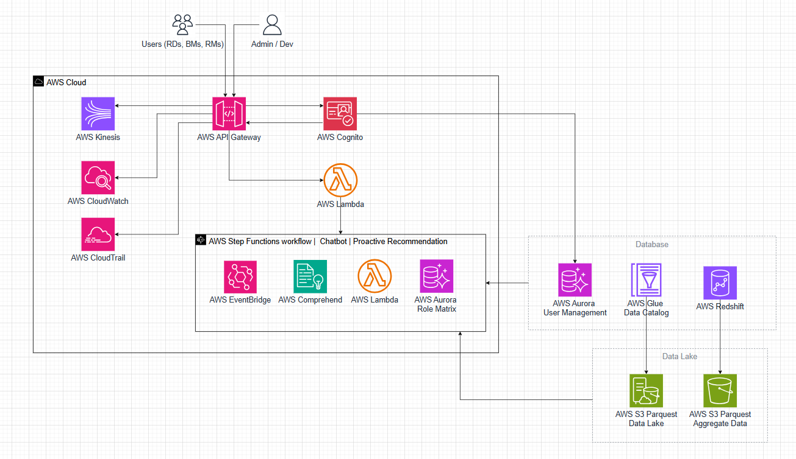

# VPBank Hackathon - WUTIP Chat Platform

A modern, AI-powered conversational interface for VPBank that enables intelligent data querying and business insights through natural language processing. This platform bridges the gap between business users and database systems, making data accessible through simple conversations.

## 🎯 Overview

**WUTIP Chat** is an innovative chatbot platform developed for the VPBank Hackathon, featuring:

- **Natural Language to SQL**: Convert business questions into executable SQL queries
- **Intelligent Data Discovery**: AI-powered insights and recommendations
- **Multi-Role Interface**: Separate dashboards for admins and end users
- **Real-time Conversations**: Interactive chat interface with conversation history
- **Data Visualization**: Chart and graph generation from query results
- **Secure Authentication**: JWT-based authentication with role-based access control

## 🎥 Demo

Watch our platform in action: [YouTube Demo](https://www.youtube.com/watch?v=gYYz-jPnbj0)

## 📋 Documentation

For detailed technical documentation, architecture diagrams, and implementation details, please refer to: [Project Documentation](https://drive.google.com/file/d/1ZZxCf3Mkb6k4V8xxbA3EWvmnhn0jrzQj/view?usp=sharing)

## 🏗️ Architecture



The platform follows a modern microservices architecture leveraging AWS cloud services:

- **Frontend**: React + TypeScript + Vite
- **API Gateway**: AWS API Gateway with Cognito authentication
- **Backend Processing**: AWS Lambda functions
- **AI/ML**: AWS Comprehend + Custom NLP models
- **Data Layer**: AWS Aurora + S3 + Redshift
- **Monitoring**: CloudWatch + EventBridge

## ✨ Key Features

### 🤖 Intelligent Chatbot
- Natural language understanding for business queries
- Context-aware conversations with memory
- SQL query generation and execution
- Support for complex data analysis requests

### 👥 Role-Based Access
- **Admin Dashboard**: Full system management and analytics
- **User Interface**: Simplified conversation experience
- **Authentication**: Secure JWT-based login system

### 📊 Data Analytics
- Real-time query execution
- Export results to Excel/CSV
- Interactive charts and visualizations
- System performance monitoring

### 🔐 Security & Compliance
- AWS Cognito integration
- Role-based permission system
- Secure API endpoints
- Data encryption in transit and at rest

## 🚀 Getting Started

### Prerequisites

- Node.js 18+ 
- npm or yarn
- Access to VPBank development environment

### Installation

1. **Clone the repository**
```bash
git clone https://github.com/phuquocchamp/vpbank-hackathon-fe.git
cd vpbank-hackathon-fe
```

2. **Install dependencies**
```bash
npm install
```

3. **Configure environment**
```bash
cp .env.example .env
# Update environment variables with your API endpoints
```

4. **Start development server**
```bash
npm run dev
```

5. **Build for production**
```bash
npm run build
```

### Environment Variables

```env
VITE_API_BASE_URL=https://your-api-gateway-url.amazonaws.com
VITE_AWS_REGION=ap-southeast-1
VITE_COGNITO_USER_POOL_ID=your-user-pool-id
VITE_COGNITO_CLIENT_ID=your-client-id
```

## 🛠️ Technology Stack

### Frontend
- **React 19** - Modern UI library with concurrent features
- **TypeScript** - Type-safe development
- **Vite** - Fast build tool and dev server
- **Tailwind CSS** - Utility-first CSS framework
- **Radix UI** - Headless component library
- **React Router** - Client-side routing
- **Recharts** - Data visualization library

### State Management
- **Zustand** - Lightweight state management
- **React Context** - Authentication and conversation state

### Authentication
- **JWT Decode** - Token parsing and validation
- **AWS Cognito** - User authentication service

### UI Components
- **Lucide React** - Beautiful icons
- **Shadcn/ui** - Modern component system
- **Next Themes** - Dark/light mode support

## 📱 Features by Role

### Admin Console
- 📈 **System Dashboard**: Real-time metrics and analytics
- 👤 **User Management**: User administration and permissions
- 💬 **Conversation Management**: View and manage all conversations
- 📊 **Knowledge Base**: Manage AI training data
- 📋 **System Reports**: Comprehensive reporting tools
- 🛠️ **Help & Support**: Administrative tools and documentation

### User Interface
- 💬 **Conversations**: Interactive chat with AI assistant
- 📊 **Analytics**: Personal usage statistics
- 👥 **User Profile**: Account management
- 📱 **Dashboard**: Personalized overview

## 🏛️ Project Structure

```
src/
├── components/          # Reusable UI components
│   ├── auth/           # Authentication components
│   ├── layout/         # Layout and navigation
│   ├── ui/             # Base UI components (shadcn/ui)
│   └── common/         # Shared components
├── pages/              # Page components
│   ├── admin/          # Admin dashboard pages
│   ├── client/         # User interface pages
│   └── auth/           # Authentication pages
├── contexts/           # React contexts for state
├── hooks/              # Custom React hooks
├── lib/                # Utility functions
└── config/             # Configuration files
```

## 🔧 Development

### Code Style
This project uses ESLint with TypeScript for code quality:

```bash
npm run lint          # Check for linting errors
npm run lint:fix      # Auto-fix linting errors
```

### Type Checking
```bash
npm run type-check    # Run TypeScript compiler
```

### Building
```bash
npm run build         # Production build
npm run preview       # Preview production build
```

## 🤝 Contributing

1. Fork the repository
2. Create your feature branch (`git checkout -b feature/amazing-feature`)
3. Commit your changes (`git commit -m 'Add some amazing feature'`)
4. Push to the branch (`git push origin feature/amazing-feature`)
5. Open a Pull Request

## 📄 License

This project is proprietary and confidential. Unauthorized copying or distribution is prohibited.

## 👨‍💻 Team

Developed for VPBank Hackathon 2024
- **Frontend Team**: React/TypeScript specialists
- **Backend Team**: AWS cloud architects
- **AI/ML Team**: Natural language processing experts
- **DevOps Team**: Infrastructure and deployment

## 🆘 Support

For technical support or questions:
- 📧 Email: [hoangtanphuquoc](mailto:hoangtanphuquoc@gmail.com)
- 📋 Issues: Create an issue in this repository
- 📖 Documentation: [Technical Documentation](https://drive.google.com/file/d/1ZZxCf3Mkb6k4V8xxbA3EWvmnhn0jrzQj/view?usp=sharing)

---

**Built with ❤️ for VPBank Hackathon 2025**
